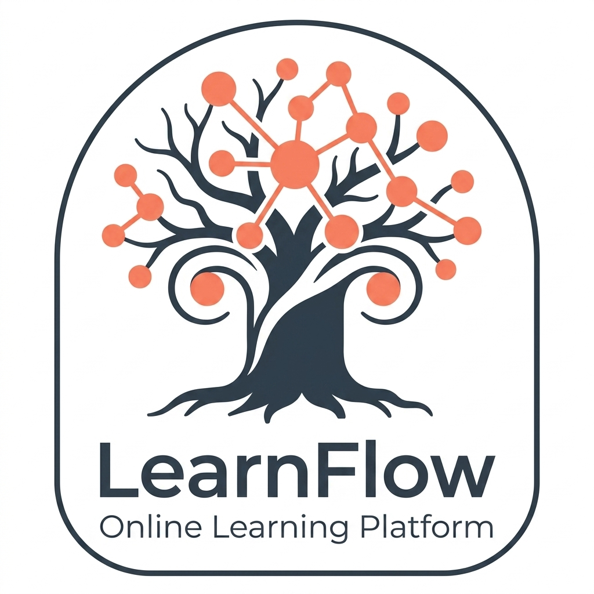
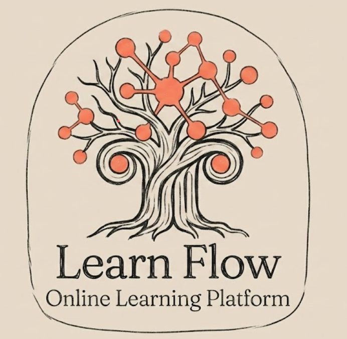
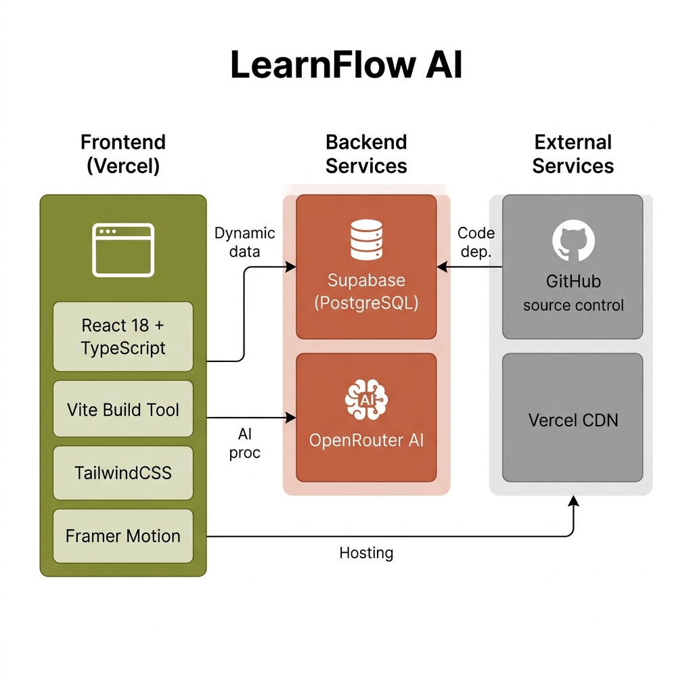
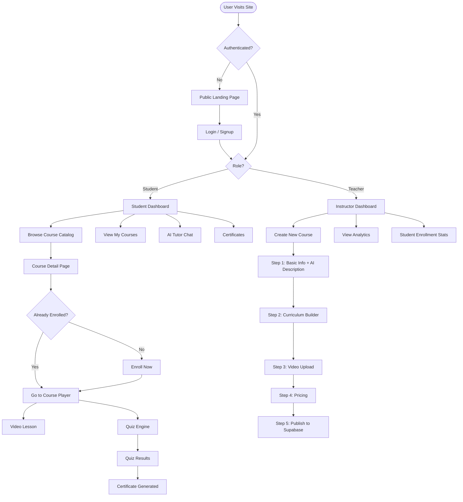
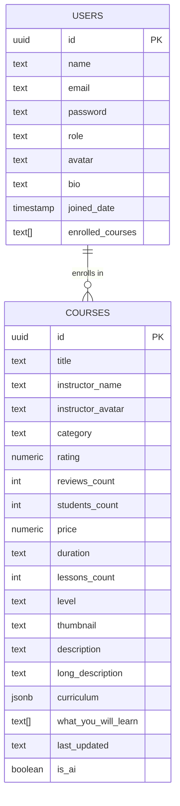
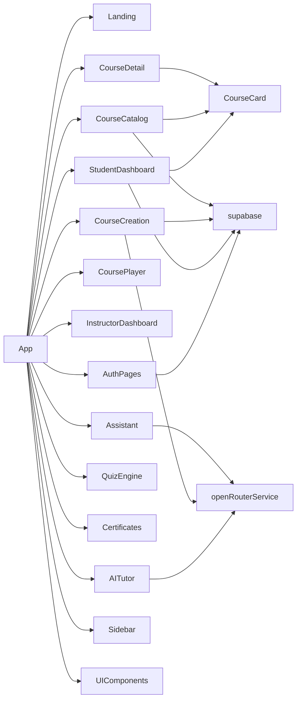

<p align="center">
  
</p>

<h1 align="center">LearnFlow AI</h1>

<p align="center">
  <b>An AI-Powered Learning Management System built with React, Supabase & OpenRouter AI</b>
</p>

<p align="center">
  
  
  
  
  
  
</p>

<p align="center">
  
</p>

---

## 📸 Screenshots

<p align="center">
  
</p>

---

## 🌟 Features

### 🎓 Student Experience
- **Personalized Dashboard** — Progress tracking, enrolled courses, AI recommendations
- **Course Catalog** — Search, filter by category, level & price with real-time results
- **Course Detail Page** — Curriculum preview, instructor bio, video trailer preview
- **Course Player** — Video lessons, markdown articles, progress tracking per lesson
- **AI Tutor (Chat)** — Context-aware AI assistant powered by NVIDIA Nemotron via OpenRouter
- **Quiz Engine** — Timed MCQ quizzes with instant feedback & score analytics
- **Certificates** — Auto-generated course completion certificates with verification codes
- **My Courses** — Quick access to all enrolled & in-progress courses

### 🏫 Instructor Experience
- **Instructor Dashboard** — Revenue, student enrollment, course performance analytics
- **Course Creation Wizard** — 5-step guided course builder with:
  - AI-generated course descriptions
  - Video upload (trailer + lesson videos)
  - Curriculum builder (sections & lessons)
  - Pricing configuration (Free / Paid / Subscription)
- **Course Management** — Edit, publish, and monitor engagement

### 🤖 AI Features
- **Floating AI Concierge** — Always-available AI assistant on every page
- **AI Course Descriptions** — One-click AI-generated professional descriptions
- **Smart Recommendations** — AI-curated course suggestions on student dashboard
- **Contextual AI Tutor** — Course-aware responses during lesson playback

### 🔐 Authentication
- Email/Password signup & login
- Role-based access: **Student** vs **Teacher** dashboard routing
- Session persistence via Supabase

---

## 🏗️ Architecture

<p align="center">
  
</p>

---

## 🔄 Application Flow



---

## 🗄️ Database Schema (Supabase / PostgreSQL)



---

## 🧭 Component Map



---

## 🛠️ Tech Stack

| Category | Technology |
|---|---|
| **Frontend Framework** | React 18 + TypeScript |
| **Build Tool** | Vite 5 |
| **Styling** | TailwindCSS + Custom CSS |
| **Animations** | Framer Motion |
| **Icons** | Lucide React |
| **Database** | Supabase (PostgreSQL) |
| **Auth** | Supabase (email/password) |
| **AI API** | OpenRouter → NVIDIA Nemotron |
| **Hosting** | Vercel (Frontend) |
| **Version Control** | GitHub |

---

## 🚀 Local Setup

### Prerequisites
- Node.js 18+
- npm or yarn
- A [Supabase](https://supabase.com) account
- An [OpenRouter](https://openrouter.ai) API key

### 1. Clone the Repository
```bash
git clone https://github.com/tonyboss365/Learn-Flow.git
cd Learn-Flow
```

### 2. Install Dependencies
```bash
npm install
```

### 3. Set Up Environment Variables
Create a `.env.local` file in the root directory:
```env
VITE_SUPABASE_URL=your_supabase_project_url
VITE_SUPABASE_ANON_KEY=your_supabase_anon_key
VITE_OPENROUTER_API_KEY=your_openrouter_api_key
```

### 4. Set Up Supabase Database
Run the following SQL in your **Supabase SQL Editor**:

```sql
-- Users table
CREATE TABLE users (
  id UUID DEFAULT gen_random_uuid() PRIMARY KEY,
  name TEXT NOT NULL,
  email TEXT UNIQUE NOT NULL,
  password TEXT NOT NULL,
  role TEXT DEFAULT 'student' CHECK (role IN ('student', 'teacher')),
  avatar TEXT,
  bio TEXT,
  joined_date TIMESTAMPTZ DEFAULT NOW(),
  enrolled_courses TEXT[] DEFAULT '{}'
);

-- Courses table
CREATE TABLE courses (
  id UUID DEFAULT gen_random_uuid() PRIMARY KEY,
  title TEXT NOT NULL,
  instructor_name TEXT,
  instructor_avatar TEXT,
  category TEXT,
  rating NUMERIC DEFAULT 0,
  reviews_count INT DEFAULT 0,
  students_count INT DEFAULT 0,
  price NUMERIC DEFAULT 0,
  duration TEXT DEFAULT '0H 0M',
  lessons_count INT DEFAULT 0,
  level TEXT DEFAULT 'Beginner',
  thumbnail TEXT,
  description TEXT,
  long_description TEXT,
  curriculum JSONB DEFAULT '[]',
  what_you_will_learn TEXT[] DEFAULT '{}',
  last_updated TEXT,
  is_ai BOOLEAN DEFAULT FALSE,
  created_at TIMESTAMPTZ DEFAULT NOW()
);

-- Enable Row Level Security (RLS) and set policies as needed
ALTER TABLE users ENABLE ROW LEVEL SECURITY;
ALTER TABLE courses ENABLE ROW LEVEL SECURITY;

CREATE POLICY "Allow all" ON users FOR ALL USING (true);
CREATE POLICY "Allow all" ON courses FOR ALL USING (true);
```

### 5. Start the Development Server
```bash
npm run dev
```

Open [http://localhost:3000](http://localhost:3000) 🎉

---

## ☁️ Deploy to Vercel

### 1. Push to GitHub (already done ✅)

### 2. Import to Vercel
1. Go to [vercel.com](https://vercel.com) → **Add New Project**
2. Import **`Learn-Flow`** from GitHub
3. Framework: **Vite** (auto-detected)

### 3. Add Environment Variables in Vercel
| Name | Value |
|---|---|
| `VITE_SUPABASE_URL` | Your Supabase Project URL |
| `VITE_SUPABASE_ANON_KEY` | Your Supabase Anon Key |
| `VITE_OPENROUTER_API_KEY` | Your OpenRouter API Key |

### 4. Deploy → Live! 🚀

> After deploying, update your Supabase project's **Site URL** to your Vercel domain in **Supabase → Settings → API**.

---

## 📁 Project Structure

```
Learn-Flow/
├── 📁 components/
│   ├── AITutor.tsx          # AI chat interface
│   ├── Assistant.tsx        # Floating AI concierge
│   ├── AuthPages.tsx        # Login & Signup
│   ├── Certificates.tsx     # Certificate viewer
│   ├── CourseCard.tsx       # Reusable course card
│   ├── CourseCatalog.tsx    # Browse/search courses
│   ├── CourseCreation.tsx   # 5-step course wizard
│   ├── CourseDetail.tsx     # Course overview page
│   ├── CoursePlayer.tsx     # Video lesson player
│   ├── InstructorDashboard.tsx  # Teacher analytics
│   ├── Landing.tsx          # Public home page
│   ├── MyCourses.tsx        # Student's courses
│   ├── QuizEngine.tsx       # Interactive quiz
│   ├── QuizResults.tsx      # Score & review
│   ├── Sidebar.tsx          # Navigation sidebar
│   ├── StudentDashboard.tsx # Student home
│   └── UIComponents.tsx     # Shared UI library
├── 📁 services/
│   └── openRouterService.ts # AI API integration
├── 📁 utils/
│   └── supabase.ts          # Database client
├── 📁 docs/
│   └── images/              # README assets
├── App.tsx                  # Root with view router
├── types.ts                 # TypeScript interfaces
├── constants.ts             # App constants & mock data
├── index.tsx                # Entry point
├── vite.config.ts           # Vite configuration
├── vercel.json              # Vercel SPA routing
└── .env.local               # Local environment vars (gitignored)
```

---

## 🤝 Contributing

1. Fork the repository
2. Create a feature branch: `git checkout -b feature/amazing-feature`
3. Commit your changes: `git commit -m 'Add amazing feature'`
4. Push to the branch: `git push origin feature/amazing-feature`
5. Open a Pull Request

---

## 📄 License

This project is licensed under the **Apache 2.0 License** — see the [LICENSE](LICENSE) file for details.

---

## 👨‍💻 Developer

Built with ❤️ by **Tony Boss**

[](https://github.com/tonyboss365)

---

<p align="center">
  
  <br/>
  <b>LearnFlow AI — Learn Smarter, Not Harder.</b>
</p>
